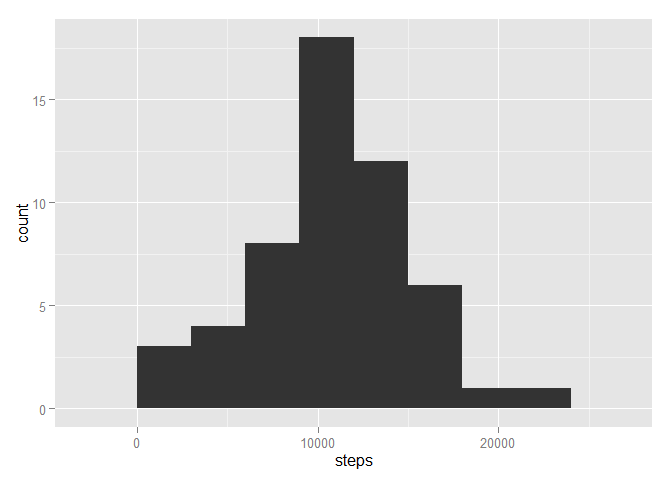
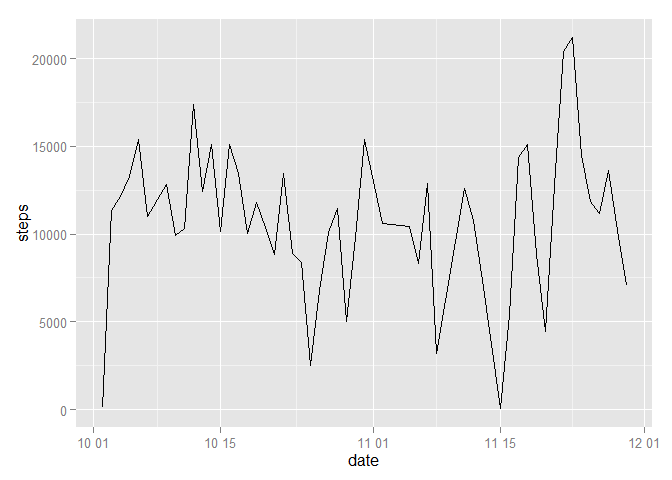
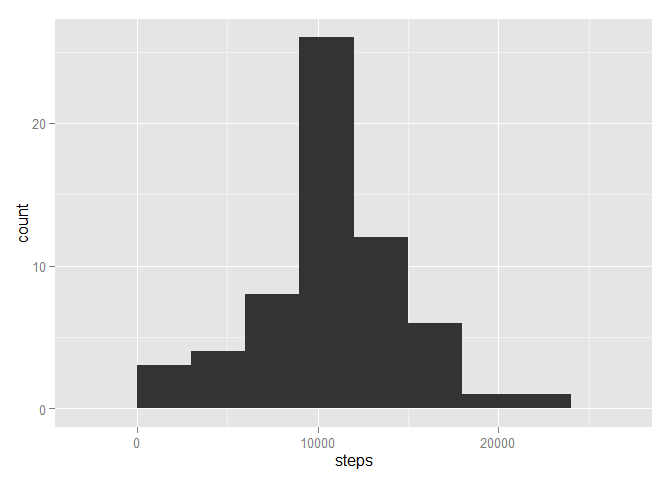

# Reproducible Research: Peer Assessment 1


## Loading and preprocessing the data

```r
data.dir <- "E:\\R & Courses\\My Projects\\Reproducible Research\\Peer Assessment\\Data"

setwd(data.dir)

raw.data <- read.csv(list.files(data.dir))
data <- na.omit(raw.data) # Exclude NAs from dataframe
data$date <- as.Date(data$date, "%Y-%m-%d")
```


## What is mean total number of steps taken per day?

```r
daily.steps <- aggregate(steps ~ date, data = data, sum)
mean(daily.steps$steps)
```

```
## [1] 10766.19
```

## What is the average daily activity pattern?
### Histogram

```r
library(ggplot2)
qplot(steps, data = daily.steps, geom = "histogram", binwidth = 3000)
```

 

### Time Series Plot

```r
qplot(date, steps, data = daily.steps, geom = "line")
```

 

```r
mean(daily.steps$steps)
```

```
## [1] 10766.19
```

```r
median(daily.steps$steps)
```

```
## [1] 10765
```

## Imputing missing values

```r
new.data <- raw.data
interval.steps.mean <- aggregate(steps ~ interval, data = data, mean)
new.data$steps <- ifelse(is.na(raw.data$steps),interval.steps.mean$steps, raw.data$steps)

new.daily.steps <- aggregate(steps ~ date, data = new.data, sum)

qplot(steps, data = new.daily.steps, geom = "histogram", binwidth = 3000)
```

 

```r
mean(new.daily.steps$steps)
```

```
## [1] 10766.19
```

```r
median(new.daily.steps$steps)
```

```
## [1] 10766.19
```
Replacing missing values with mean 5-minute intervals make the overall distribution more concentrated to the centre with stronger normal distribution. While mean value remain the same, median value changed and becomes the same as mean value.

## Are there differences in activity patterns between weekdays and weekends?

```r
new.data <- raw.data
new.data$date <- as.Date(new.data$date, "%Y-%m-%d")
day <- as.character(weekdays(new.data$date))
new.data$day <- ifelse(day == "Saturday" | day == "Sunday", "Weekend", "Weekday")

# Plot average number of steps by interval grouped by weekend and weekday
plot.data <- aggregate(steps ~ interval + day, data = new.data, mean)
qplot(interval, steps, data = plot.data[plot.data$day == "Weekend",], geom = "line")
```

 


```r
qplot(interval, steps, data = plot.data[plot.data$day == "Weekday",], geom = "line")
```

 

Weekends tend to have more steps than weekdays and more uniform spread.

